# Emerging_Technology_Assignment

For this assignment we had to create a notebook through Jupyter to solve tasks assigned to up by our lecturer Dr. Ian McLoughlin. The tasks were.

## Task 1
Write a Python function called sqrt2 that calculates and prints to the screen the square root of 2 to 100 decimal places. You cannot use the libraries python has to do this task. My direction to complete this task was to create a variable called 'x' and equals it to 2 and then get the square root of this variable by multiplying it by 0.5 and then this will give the answer 1.41 in 2 decimal places. 

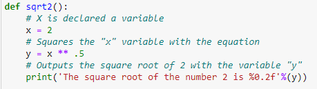

After this i set out by creating a new variable call 'g' which has a multiplication of 10 x 100 in it which is the maths method for googol which stands for the digit 1 followed by 100 zeros. We create a while loop for a more accurate result for the square root and this involves doing division  specifically floor division to return the largest possible integer. 
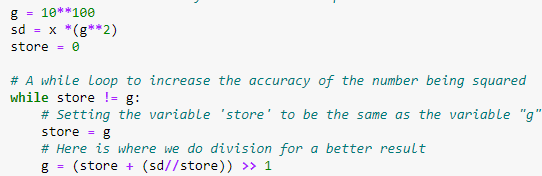

I then go about outputting the value by creating a list storing the 'g' variable to a new variable called 'store2', then create the inseration of the decimal point after the number 1, then have to join the rest of the numbers in 'store2' by creating a new variable called 'out_sqrt' and this will give me my result for the square root of 2 outputted to 100 decimal places.

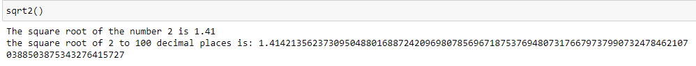

## Task 2
Using scipy.stats to verify the value found using the chi-squared test for independence method and also calculate the associated P Value. The Chi-Squared test compares variables in a contingency table to see if they are related and tests to see whether distributions of categorical variables differ from each another.

To calculate using the Chi-Squared formula we use the following image:

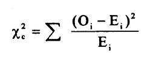

The values given to us for the task were as follows: 

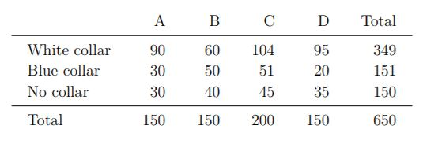

I started out by importing scipy.stats and inputing the data in an array and then the different functions for the chi function. Then i printed out the results of the chi-squared value, P-Value, degree of freedom and expected value

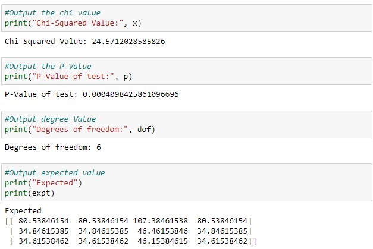

## Task 3
Using numpy outline the differences between STDEV.S and STDEV.P while using their respective formula. Then also demonstrate why STDEV.S is a better estimate for the standard deviation of a population instead of STDEV.P.

STDEV.P function is used when your data represents the entire population. For the squared deviation 
it is divided by the total number of sample -1. It is represented as N.

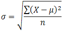

STDEV.S function is used when your data is a sample of the entire population. For the squared deviation,
it is divided by the total number of arguments, mostly represented as N-1.

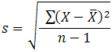

I start out by importing numpy and then created two arrays called population and sample with population storing a load of random numbers and sample storing a certain few numbers from that array.

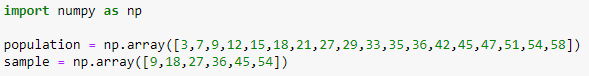

Then i created the actual lines of code with one doing the STDEV.P of the population array and then the next was doing the STDEV.P of the sample data and finally the STDEV.S using the sample data set. 

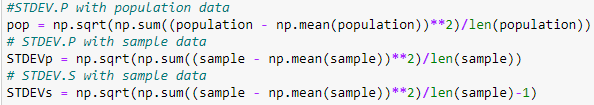

Finally i output the code with print methods for each separately.

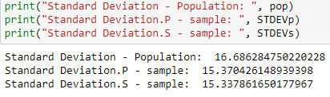

 
## Task 4
Use scikit-learn apply k-means clustering to Fisher’s famous Iris data set. 

The KMeans algorithm clusters data by trying to separate samples in n groups of equal variance, minimizing a criterion known as the inertia or within-cluster sum-of-squares. This algorithm requires the number of clusters to be specified. It scales well to large number of samples and has been used across a large range of application areas in many different fields.

The iris data set consists of 50 samples from each of three species of Iris (Iris versicolor, Iris setosa and Iris virginica). Four features were measured from each sample: the length and the width of the sepals and petals, in centimeters. Based on the combination of these four features, Fisher developed a linear discriminant model to distinguish the species from each other.

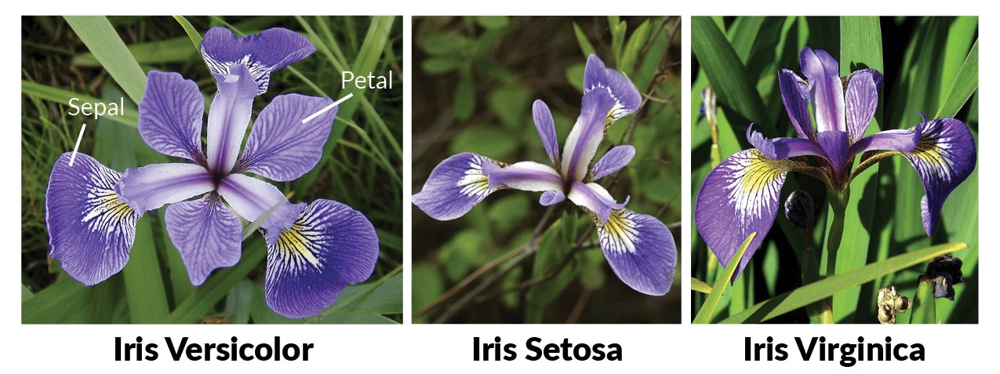

Firstly i started the task by importing the librarues needed for this task and in total i used 5 which all had a part in parts of the code. Sklearn, numpy, kmeans, matplotlib and pandas. Here i also added the loading part for the iris data set.

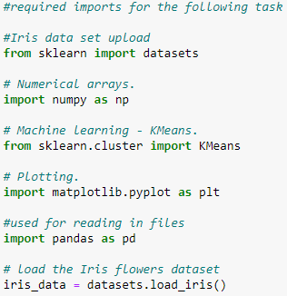

Next i outputted the table of what are data is coming from. This includes the sepal and petal lengths and widths each.

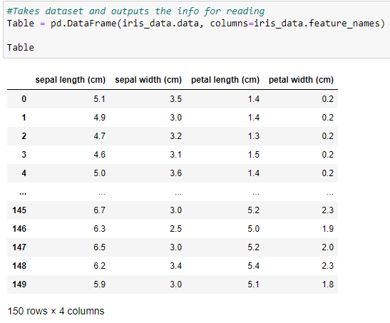

I then created a scatterplot to output my findings.

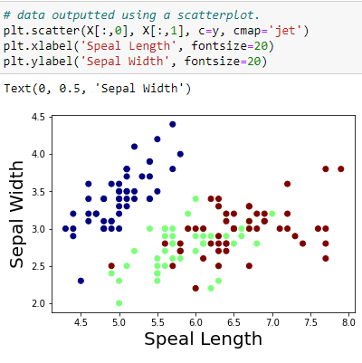

Next i outputted the center point i found.

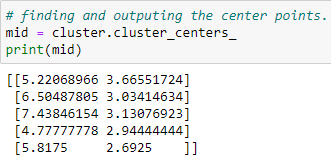

Finally i took my original findings from the first scatterplot and put them side by side against by latest findings and results were shown on two seperate scatterplots.

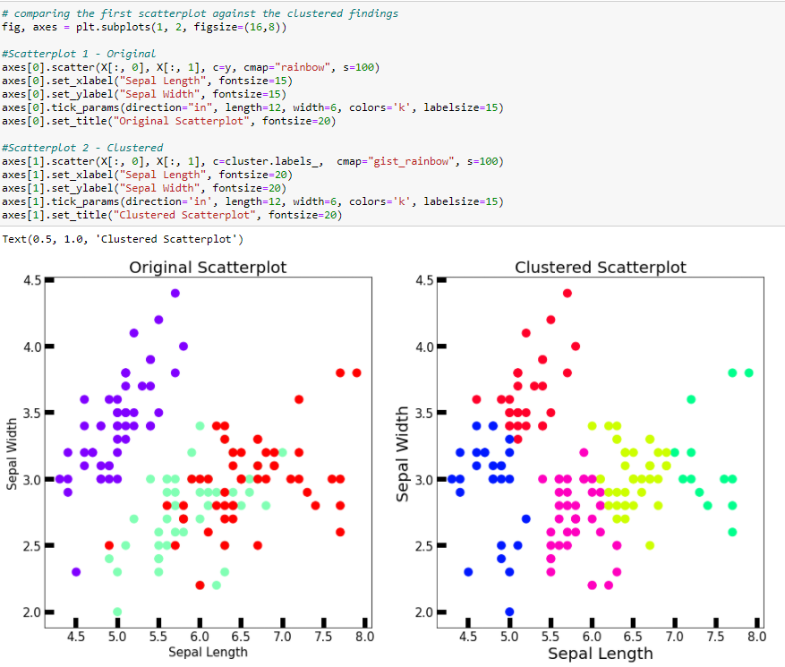

# How to run the Jupyter Notebook
**Note - You must have Anaconda installed on your PC to run this assignment

1. Clone this repo to your machine using cmd and the url in git
2. Using command Prompt direct to where repo is cloned on your machine 
3. Here type 'jupyter notebook' in command prompt and this will launch a window on your perfered internet browser.
4. When jupyter home page is running click on the file 'Tasks.ipynb' and this will launch the notebook with all my task created.
